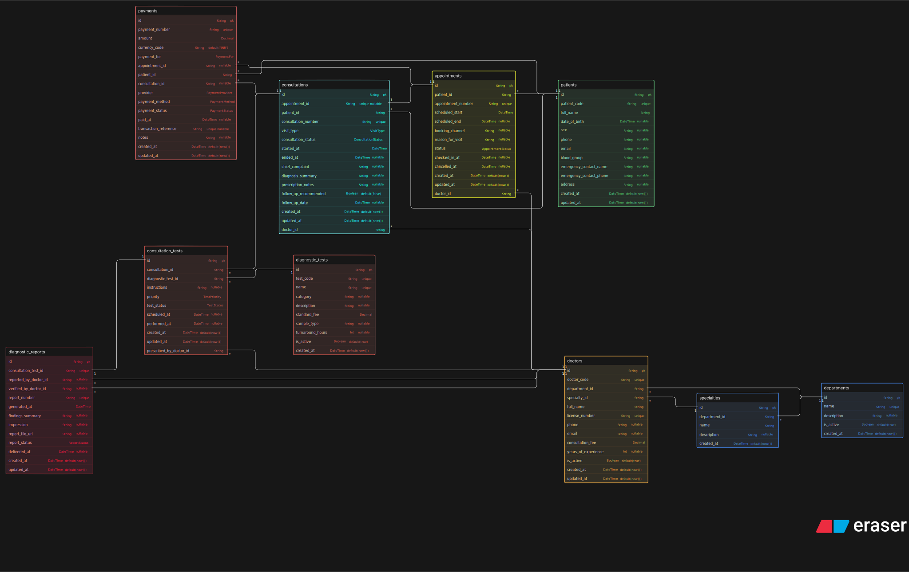

# 🏥 Clinic Appointment and Diagnostics Platform — Database Design

> **Assignment:** ER Diagram Design for a Clinic Management System  
> **Submitted by:** Suprabhat  
> **Tool Used:** Excalidraw  
> **Diagram File:** [`diagram.svg`](./diagram.svg)

---

## 📌 Overview

This project presents the **Entity-Relationship (ER) diagram** for a modern clinic that digitally manages its core operations — including patient registration, doctor management, appointment scheduling, consultations, diagnostic test prescriptions, lab reports, and payments.

The design is focused, scalable, and captures real-world clinic workflows without over-engineering into a hospital-level system.

---

## 🗺️ ER Diagram



> The full interactive board is available on Excalidraw. The exported SVG is included in this repository.

---

## 🏗️ Entities & Attributes

### 1. 🟢 `Patient`
Stores information about individuals registered at the clinic.

| Attribute | Type | Constraints |
|-----------|------|-------------|
| `id` | String | **PK** |
| `patient_code` | String | Unique |
| `full_name` | String | Required |
| `date_of_birth` | DateTime | Nullable |
| `sex` | String | Nullable |
| `phone` | String | Nullable |
| `email` | String | Nullable |
| `blood_group` | String | Nullable |
| `emergency_contact_name` | String | Nullable |
| `emergency_contact_phone` | String | Nullable |
| `address` | String | Nullable |
| `created_at` | DateTime | Default: now() |
| `updated_at` | DateTime | Default: now() |

---

### 2. 🟠 `Doctor`
Represents doctors affiliated with the clinic, linked to their department and specialty.

| Attribute | Type | Constraints |
|-----------|------|-------------|
| `id` | String | **PK** |
| `doctor_code` | String | Unique |
| `department_id` | String | **FK** → Department |
| `specialty_id` | String | **FK** → Specialty |
| `full_name` | String | Required |
| `license_number` | String | Unique |
| `phone` | String | Nullable |
| `email` | String | Nullable |
| `consultation_fee` | Decimal | Required |
| `years_of_experience` | Int | Nullable |
| `is_active` | Boolean | Default: true |
| `created_at` | DateTime | Default: now() |
| `updated_at` | DateTime | Default: now() |

---

### 3. 🔵 `Department`
Represents clinical departments within the facility (e.g., Cardiology, General Medicine).

| Attribute | Type | Constraints |
|-----------|------|-------------|
| `id` | String | **PK** |
| `name` | String | Unique |
| `description` | String | Nullable |
| `is_active` | Boolean | Default: true |
| `created_at` | DateTime | Default: now() |

---

### 4. 🔵 `Specialty`
Represents medical specialties independently from departments (e.g., a doctor can have a specialty within any department).

| Attribute | Type | Constraints |
|-----------|------|-------------|
| `id` | String | **PK** |
| `name` | String | Unique |
| `description` | String | Nullable |
| `created_at` | DateTime | Default: now() |

---

### 5. 🟡 `Appointment`
Records a patient's scheduled time slot with a specific doctor.

| Attribute | Type | Constraints |
|-----------|------|-------------|
| `id` | String | **PK** |
| `patient_id` | String | **FK** → Patient |
| `doctor_id` | String | **FK** → Doctor |
| `appointment_number` | String | Unique |
| `scheduled_start` | DateTime | Required |
| `scheduled_end` | DateTime | Nullable |
| `booking_channel` | String | Nullable |
| `reason_for_visit` | String | Nullable |
| `status` | AppointmentStatus | Enum |
| `checked_in_at` | DateTime | Nullable |
| `cancelled_at` | DateTime | Nullable |
| `created_at` | DateTime | Default: now() |
| `updated_at` | DateTime | Default: now() |

> **AppointmentStatus Enum:** `SCHEDULED`, `CONFIRMED`, `CHECKED_IN`, `COMPLETED`, `CANCELLED`, `NO_SHOW`

---

### 6. 🩵 `Consultation`
Represents the actual clinical visit that may result from an appointment. A consultation can exist without an appointment (walk-in) — hence `appointment_id` is nullable.

| Attribute | Type | Constraints |
|-----------|------|-------------|
| `id` | String | **PK** |
| `appointment_id` | String | **FK** → Appointment, Unique, Nullable |
| `patient_id` | String | **FK** → Patient |
| `consultation_number` | String | Unique |
| `visit_type` | VisitType | Enum |
| `consultation_status` | ConsultationStatus | Enum |
| `started_at` | DateTime | Required |
| `ended_at` | DateTime | Nullable |
| `chief_complaint` | String | Nullable |
| `diagnosis_summary` | String | Nullable |
| `prescription_notes` | String | Nullable |
| `doctor_id` | String | **FK** → Doctor |
| `follow_up_date` | DateTime | Nullable |
| `created_at` | DateTime | Default: now() |
| `updated_at` | DateTime | Default: now() |

> **VisitType Enum:** `IN_PERSON`, `WALK_IN`, `TELECONSULT`  
> **ConsultationStatus Enum:** `IN_PROGRESS`, `COMPLETED`, `REFERRED`

---

### 7. 🔬 `DiagnosticTest`
A catalog/master table of available diagnostic tests at the clinic.

| Attribute | Type | Constraints |
|-----------|------|-------------|
| `id` | String | **PK** |
| `test_code` | String | Unique |
| `name` | String | Required |
| `description` | String | Nullable |
| `category` | String | Nullable |
| `standard_price` | Decimal | Required |
| `turnaround_hours` | Int | Nullable |
| `is_active` | Boolean | Default: true |
| `created_at` | DateTime | Default: now() |

---

### 8. 📋 `PrescribedTest`
A junction/prescription entity that links a consultation to one or more diagnostic tests. This is where the doctor prescribes tests during a visit.

| Attribute | Type | Constraints |
|-----------|------|-------------|
| `id` | String | **PK** |
| `consultation_id` | String | **FK** → Consultation |
| `test_id` | String | **FK** → DiagnosticTest |
| `prescribed_by` | String | **FK** → Doctor |
| `prescribed_at` | DateTime | Default: now() |
| `notes` | String | Nullable |
| `status` | PrescribedTestStatus | Enum |
| `priority` | String | Nullable |

> **PrescribedTestStatus Enum:** `PENDING`, `SAMPLE_COLLECTED`, `PROCESSING`, `COMPLETED`, `CANCELLED`

---

### 9. 📄 `DiagnosticReport`
Stores the test report generated by the lab after sample analysis. Linked to both the prescribed test and the consultation.

| Attribute | Type | Constraints |
|-----------|------|-------------|
| `id` | String | **PK** |
| `prescribed_test_id` | String | **FK** → PrescribedTest, Unique |
| `report_number` | String | Unique |
| `consultation_id` | String | **FK** → Consultation |
| `patient_id` | String | **FK** → Patient |
| `result_summary` | String | Nullable |
| `result_data` | String | Nullable (JSON/text) |
| `is_abnormal` | Boolean | Nullable |
| `abnormality_notes` | String | Nullable |
| `reported_by` | String | Nullable |
| `reported_at` | DateTime | Nullable |
| `verified_by` | String | Nullable |
| `verified_at` | DateTime | Nullable |
| `file_url` | String | Nullable |
| `created_at` | DateTime | Default: now() |

---

### 10. 💰 `Payment`
Records payment transactions associated with appointments or consultations.

| Attribute | Type | Constraints |
|-----------|------|-------------|
| `id` | String | **PK** |
| `payment_number` | String | Unique |
| `patient_id` | String | **FK** → Patient |
| `appointment_id` | String | **FK** → Appointment, Nullable |
| `consultation_id` | String | **FK** → Consultation, Nullable |
| `amount` | Decimal | Required |
| `currency` | String | Default: 'INR' |
| `payment_method` | String | Nullable |
| `payment_status` | PaymentStatus | Enum |
| `paid_at` | DateTime | Nullable |
| `transaction_ref` | String | Nullable |
| `notes` | String | Nullable |
| `created_at` | DateTime | Default: now() |
| `updated_at` | DateTime | Default: now() |

> **PaymentStatus Enum:** `PENDING`, `PAID`, `FAILED`, `REFUNDED`, `PARTIAL`

---

## 🔗 Relationships

| From | Relationship | To | Notes |
|------|-------------|-----|-------|
| Doctor | Many → One | Department | Each doctor belongs to one department |
| Doctor | Many → One | Specialty | Each doctor has one specialty |
| Appointment | Many → One | Patient | A patient can have many appointments |
| Appointment | Many → One | Doctor | A doctor can have many appointments |
| Consultation | One → One (opt.) | Appointment | One appointment leads to at most one consultation; nullable for walk-ins |
| Consultation | Many → One | Patient | A patient can have many consultations |
| Consultation | Many → One | Doctor | A doctor can see many patients |
| PrescribedTest | Many → One | Consultation | One consultation can have many prescribed tests |
| PrescribedTest | Many → One | DiagnosticTest | Each prescription references a test from the catalog |
| DiagnosticReport | One → One | PrescribedTest | Each prescribed test produces one report |
| DiagnosticReport | Many → One | Consultation | Multiple reports may link to one consultation |
| DiagnosticReport | Many → One | Patient | Reports are tied to the patient |
| Payment | Many → One | Patient | A patient may have many payments |
| Payment | Many → One (opt.) | Appointment | Payment may be linked to an appointment |
| Payment | Many → One (opt.) | Consultation | Payment may be linked to a consultation |

---

## 💡 Design Decisions & Reasoning

### ➤ Appointment vs. Consultation — They are separate entities
An **appointment** is a *scheduled intent* — it may be cancelled, rescheduled, or never result in a visit.  
A **consultation** is the *actual clinical encounter*. They are kept separate because:
- Walk-in patients never create appointments
- Appointments can be no-shows
- Tracking both independently gives richer audit history

### ➤ Does one appointment always lead to one consultation?
**No.** The relationship is **1:0..1** — an appointment may result in zero or one consultation. The `appointment_id` in `Consultation` is nullable to also support walk-in consultations.

### ➤ Where do tests belong — appointment or consultation?
Tests are **prescribed during a consultation**, not an appointment. A doctor can only prescribe after actually seeing the patient. Hence `PrescribedTest` links to `Consultation`, not `Appointment`.

### ➤ Doctor Specialty — separate entity or attribute?
**Separate entity.** Specialty is modeled as a lookup table (`Specialty`) to allow:
- Reuse across multiple doctors
- Easy filtering/searching by specialty
- Future extensibility (add approval flows, credentials, etc.)

### ➤ Can one consultation lead to multiple tests?
**Yes.** The `PrescribedTest` table acts as a one-to-many bridge between `Consultation` and `DiagnosticTest`. Each row represents one prescribed test for one consultation.

### ➤ How are reports linked?
Each `DiagnosticReport` is tied to exactly one `PrescribedTest` (1:1). It also redundantly stores `consultation_id` and `patient_id` for fast direct queries — this is a deliberate denormalization choice for retrieval performance.

### ➤ How is payment connected?
`Payment` is flexible — it can be linked to an **appointment** (for pre-payment or cancellation fees), a **consultation** (for post-visit billing), or both. Both FKs are nullable to handle partial tracking scenarios.

---

## 📊 Answering Business Questions

| Business Question | How the Schema Answers It |
|---|---|
| Who are the doctors and their specialties? | `Doctor` → `Specialty` (via `specialty_id`) |
| Which patient booked which appointment? | `Appointment.patient_id` → `Patient` |
| What was the appointment status? | `Appointment.status` (enum field) |
| Did the appointment result in a consultation? | `Consultation.appointment_id` → `Appointment` |
| Were any diagnostic tests prescribed? | `PrescribedTest.consultation_id` → `Consultation` |
| What reports were generated? | `DiagnosticReport.prescribed_test_id` → `PrescribedTest` |
| Can one patient have many visits? | Yes — `Consultation` is many-to-one with `Patient` |
| Can one doctor attend many patients? | Yes — `Consultation` is many-to-one with `Doctor` |
| Can one consultation lead to multiple tests? | Yes — `PrescribedTest` is many-to-one with `Consultation` |
| How is payment connected? | `Payment` links to `Patient`, optionally to `Appointment` and/or `Consultation` |

---

## 📁 Repository Structure

```
Clinic Appointment and Diagnostics Platform/
├── diagram.svg      # Exported ER Diagram (Excalidraw)
└── readme.md        # This file
```

---

## 🛠️ Tools Used

- **Diagramming:** [Excalidraw](https://excalidraw.com) — for ER diagram creation
- **Version Control:** GitHub

---

> made by Suprabhat
