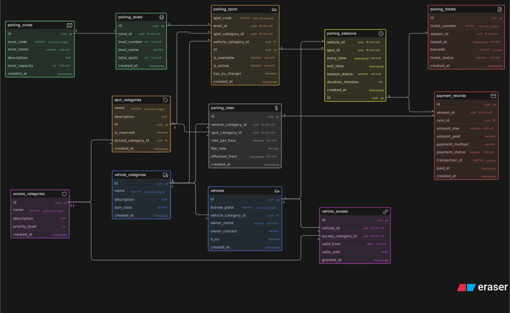

# Comic-Con India — Parking System Database Design

> **Assignment:** ER Diagram Design for a Multi-Zone Event Parking System  
> **Submitted by:** Suprabhat  
> **Tool Used:** Excalidraw  
> **Diagram File:** [`diagram.svg`](./diagram.svg)

---

## 📌 Overview

This project presents the **Entity-Relationship (ER) diagram** for a structured parking management system designed for a large-scale event like Comic-Con India. The system handles thousands of vehicles across multiple zones and levels, supports special-access categories (VIP, cosplayers, exhibitors, EV charging), tracks complete entry/exit sessions, issues parking tickets, and records payments — all in a clean, normalized, and scalable database design.

---

## 🗺️ ER Diagram



> The full interactive board is available on Excalidraw. The exported SVG is included in this repository.

---

## 🏗️ Entities & Attributes

### 1. 🟢 `ParkingZone`
Represents a named physical area within the venue (e.g., Zone A, Zone B). Each zone has a defined total capacity and can contain multiple levels.

| Attribute | Type | Constraints |
|-----------|------|-------------|
| `id` | uuid | **PK** |
| `zone_code` | varchar | Not Null, Unique |
| `zone_name` | varchar | Not Null |
| `description` | text | — |
| `total_capacity` | int | Not Null |
| `created_at` | timestamp | — |

---

### 2. 🟢 `ParkingLevel`
Represents a specific level within a zone (e.g., Ground Floor, Level 1). Multiple levels can belong to one zone.

| Attribute | Type | Constraints |
|-----------|------|-------------|
| `id` | uuid | **PK** |
| `zone_id` | uuid | **FK** → ParkingZone, Not Null |
| `level_code` | varchar | Not Null, Unique |
| `level_name` | varchar | Not Null |
| `description` | text | — |
| `total_capacity` | int | Not Null |
| `created_at` | timestamp | — |

---

### 3. 🔵 `VehicleCategory`
A master lookup table for vehicle types (e.g., Bike, Car, SUV, Cab, EV). Controls what spot types are compatible.

| Attribute | Type | Constraints |
|-----------|------|-------------|
| `id` | uuid | **PK** |
| `name` | varchar | Not Null, Unique |
| `description` | text | — |
| `size_class` | varchar | — |
| `created_at` | timestamp | — |

---

### 4. 🔵 `Vehicle`
Represents a real-world vehicle that enters the parking facility. A vehicle can visit multiple times across event days.

| Attribute | Type | Constraints |
|-----------|------|-------------|
| `id` | uuid | **PK** |
| `license_plate` | varchar | Not Null, Unique |
| `vehicle_category_id` | uuid | **FK** → VehicleCategory |
| `owner_name` | varchar | Not Null |
| `owner_contact` | varchar | — |
| `is_ev` | boolean | — |
| `created_at` | timestamp | — |

---

### 5. 🟣 `AccessCategory`
Defines special access types — e.g., General, VIP, Exhibitor, Cosplayer with Props, Staff, EV Charging. Used to mark reserved spots and assign vehicle-level permissions.

| Attribute | Type | Constraints |
|-----------|------|-------------|
| `id` | uuid | **PK** |
| `name` | varchar | Not Null, Unique |
| `description` | text | — |
| `priority_level` | int | — |
| `created_at` | timestamp | — |

---

### 6. 🟣 `VehicleAccessCategory` *(Junction Table)*
Links a vehicle to one or more access categories for a defined validity window. A cosplayer's vehicle can be granted a "Cosplayer with Props" access for event days.

| Attribute | Type | Constraints |
|-----------|------|-------------|
| `id` | uuid | **PK** |
| `vehicle_id` | uuid | **FK** → Vehicle, Not Null |
| `access_category_id` | uuid | **FK** → AccessCategory, Not Null |
| `valid_from` | date | Not Null |
| `valid_until` | date | — |
| `granted_at` | timestamp | — |

---

### 7. 🚘 `ParkingSpot`
An individual parking spot within a level. Spots have a category (general/reserved/EV) and a real-time availability flag.

| Attribute | Type | Constraints |
|-----------|------|-------------|
| `id` | uuid | **PK** |
| `level_id` | uuid | **FK** → ParkingLevel, Not Null |
| `spot_code` | varchar | Not Null, Unique |
| `spot_category_id` | uuid | **FK** → AccessCategory |
| `is_reserved` | boolean | Default: false |
| `is_available` | boolean | Default: true |
| `created_at` | timestamp | — |

---

### 8. 🟡 `ParkingSession`
Tracks a single visit of a vehicle — entry time, exit time, assigned spot, and current status. One vehicle can have many sessions across different days.

| Attribute | Type | Constraints |
|-----------|------|-------------|
| `id` | uuid | **PK** |
| `vehicle_id` | uuid | **FK** → Vehicle, Not Null |
| `spot_id` | uuid | **FK** → ParkingSpot, Not Null |
| `entry_time` | timestamp | Not Null |
| `exit_time` | timestamp | — (Null while parked) |
| `status` | varchar | e.g., ACTIVE, COMPLETED, EXITED |
| `duration_minutes` | int | — (Calculated on exit) |
| `created_at` | timestamp | — |

---

### 9. 🎫 `ParkingTicket`
A ticket issued at entry, linked to a session. Contains a unique ticket number and any discount/rate tier metadata.

| Attribute | Type | Constraints |
|-----------|------|-------------|
| `id` | uuid | **PK** |
| `session_id` | uuid | **FK** → ParkingSession, Not Null, Unique |
| `ticket_number` | varchar | Not Null, Unique |
| `issued_at` | timestamp | Not Null |
| `rate_tier` | varchar | — |
| `notes` | text | — |

---

### 10. 💰 `Payment`
Records the payment for a parking session. Linked to the session and optionally to the ticket.

| Attribute | Type | Constraints |
|-----------|------|-------------|
| `id` | uuid | **PK** |
| `session_id` | uuid | **FK** → ParkingSession, Not Null |
| `ticket_id` | uuid | **FK** → ParkingTicket, Nullable |
| `amount` | decimal | Not Null |
| `payment_method` | varchar | e.g., Cash, Card, UPI |
| `payment_status` | varchar | e.g., PENDING, PAID, WAIVED |
| `paid_at` | timestamp | — |
| `transaction_ref` | varchar | — |
| `created_at` | timestamp | — |

---

## 🔗 Relationships

| From | Relationship | To | Notes |
|------|-------------|-----|-------|
| ParkingZone | One → Many | ParkingLevel | A zone contains multiple levels |
| ParkingLevel | One → Many | ParkingSpot | A level contains multiple spots |
| VehicleCategory | One → Many | Vehicle | Each vehicle belongs to one category |
| AccessCategory | One → Many | ParkingSpot | Spots can be reserved for a category |
| Vehicle | Many ↔ Many (via junction) | AccessCategory | Managed via `VehicleAccessCategory` |
| Vehicle | One → Many | ParkingSession | One vehicle can park many times |
| ParkingSpot | One → Many | ParkingSession | One spot serves many sessions over time |
| ParkingSession | One → One | ParkingTicket | Each session produces one ticket |
| ParkingSession | One → One | Payment | Each session is linked to one payment |

---

## 💡 Design Decisions & Reasoning

### ➤ Why is Appointment vs. Session separated?
A **ParkingTicket** is the *issued proof of entry*, while a **ParkingSession** tracks the complete *duration lifecycle* (entry → exit). They are kept separate because:
- Tickets are issued at entry (before exit time is known)
- Sessions accumulate duration and status over time
- The 1:1 relationship between them is deliberate — one session = one ticket

### ➤ Can a vehicle visit multiple times?
**Yes.** `ParkingSession` is a many-to-one relationship with `Vehicle` — the same vehicle (identified by `license_plate`) can have multiple sessions across different days.

### ➤ Can a parking spot be reused?
**Yes.** `ParkingSpot` is linked many-to-one to `ParkingSession` — the same spot can serve different vehicles at different times. The `is_available` flag on `ParkingSpot` tracks real-time occupancy.

### ➤ How are reserved categories represented?
`AccessCategory` is a standalone entity (not just an enum column). Spots are tagged with a `spot_category_id` → `AccessCategory`. Vehicles get granted access categories via the `VehicleAccessCategory` junction table with date-range validity.

### ➤ How is availability tracked?
The `is_available` boolean on `ParkingSpot` is toggled when:
- A vehicle occupies it → set to `false`
- The session ends (exit recorded) → reset to `true`

Zone-level availability can be derived by counting available spots per level and aggregating per zone.

### ➤ How is EV charging handled?
`Vehicle.is_ev` flags EV vehicles. EV-specific spots are marked with the **EV Charging** `AccessCategory` via `spot_category_id`. The system can filter available EV spots and assign them based on both flags.

### ➤ How are parking charges calculated?
`ParkingSession.duration_minutes` is computed when exit is recorded. The `Payment` entity stores the final `amount`. `ParkingTicket.rate_tier` can carry pricing tier metadata (e.g., hourly, flat-rate, VIP-waived).

---

## 📊 Answering Business Questions

| Business Question | How the Schema Answers It |
|---|---|
| What vehicles entered the parking facility? | `ParkingSession` with entry timestamps |
| What type of vehicle entered? | `Vehicle.vehicle_category_id` → `VehicleCategory` |
| Which parking spot was assigned? | `ParkingSession.spot_id` → `ParkingSpot` |
| Which zone or level does that spot belong to? | `ParkingSpot.level_id` → `ParkingLevel` → `ParkingZone` |
| Was the spot reserved for VIP/Exhibitors/Staff? | `ParkingSpot.spot_category_id` → `AccessCategory` |
| When did the vehicle enter/exit? | `ParkingSession.entry_time` and `exit_time` |
| What ticket was issued? | `ParkingTicket.session_id` → `ParkingSession` |
| Can one vehicle visit multiple times? | Yes — `ParkingSession` is many-to-one with `Vehicle` |
| Can one spot be reused across sessions? | Yes — `ParkingSpot` is one-to-many with `ParkingSession` |
| How is availability tracked? | `ParkingSpot.is_available` boolean, toggled per session |
| How are charges calculated? | Duration × rate, stored in `Payment.amount` |
| How is payment recorded? | `Payment` entity, linked to `ParkingSession` |
| Can special access categories be represented? | Yes — via `AccessCategory` and `VehicleAccessCategory` |
| Which vehicles are currently parked inside? | Sessions where `exit_time` is NULL and `status = ACTIVE` |

---

## 🧩 Implementation Summary

The Comic-Con Parking System is built around **10 normalized entities** modeling the full vehicle lifecycle from arrival to payment. The physical structure is captured via `ParkingZone` → `ParkingLevel` → `ParkingSpot`, with each spot tagged to an `AccessCategory` for reserved/EV slot management. Vehicles are registered with a `VehicleCategory` and can be granted time-bounded special access roles through the `VehicleAccessCategory` junction table. When a vehicle enters, a `ParkingSession` is opened (with `exit_time` null, making currently-parked vehicles easy to query), a `ParkingTicket` is issued, and upon exit, duration is computed and a `Payment` record is created — all connected through clean FK relationships that allow full traceability from spot → level → zone for any session.

---

## 📁 Repository Structure

```
Comic-Con Parking System/
├── diagram.svg      # Exported ER Diagram (Excalidraw)
└── readme.md        # This file
```

---

## 🛠️ Tools Used

- **Diagramming:** [Excalidraw](https://excalidraw.com) — for ER diagram creation
- **Version Control:** GitHub

---

> Made by Suprabhat
