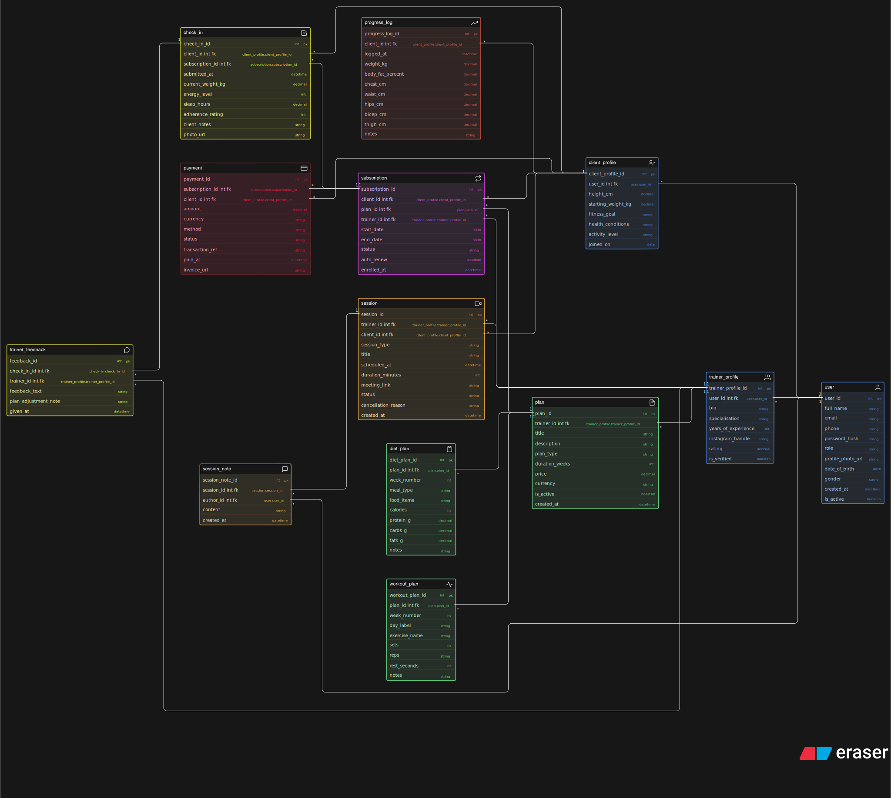

# 🏋️ Fitness Influencer Coaching Platform — Database Design

> An ER diagram for a scalable online coaching ecosystem where trainers manage clients, deliver structured fitness plans, schedule sessions, and track progress.

---

## 📌 Project Overview

A fitness influencer is launching a digital coaching platform to scale beyond Instagram DMs and video calls. The platform allows trainers to onboard clients, sell fitness programs, schedule consultations, manage subscriptions, and systematically track each client's progress through check-ins and trainer notes.

This project delivers a **relational database design (ER Diagram)** for the entire ecosystem — covering users, coaching plans, sessions, subscriptions, payments, progress tracking, and more.

---

## 📐 ER Diagram

> Designed using **Excalidraw**. The diagram uses color-coded entity groups for quick visual navigation.

---

## 🗂️ Entities & Attributes

### 👤 User
The central identity table for all platform users (clients and trainers alike).

| Attribute | Type | Constraint |
|---|---|---|
| `user_id` | int | PK |
| `full_name` | string | |
| `email` | string | |
| `phone` | string | |
| `password_hash` | string | |
| `role` | string | `'client'` \| `'trainer'` |
| `profile_photo_url` | string | |
| `date_of_birth` | date | |
| `gender` | string | |
| `created_at` | datetime | |
| `is_active` | boolean | |

---

### 🧑‍🏫 Trainer Profile
Extended profile for users with the `trainer` role.

| Attribute | Type | Constraint |
|---|---|---|
| `trainer_profile_id` | int | PK |
| `user_id` | int | FK → User |
| `bio` | string | |
| `specialisation` | string | |
| `years_of_experience` | int | |
| `instagram_handle` | string | |
| `rating` | decimal | |
| `is_verified` | boolean | |

---

### 🧑‍💪 Client Profile
Extended profile for users with the `client` role — stores fitness-specific onboarding data.

| Attribute | Type | Constraint |
|---|---|---|
| `client_profile_id` | int | PK |
| `user_id` | int | FK → User |
| `height_cm` | decimal | |
| `starting_weight_kg` | decimal | |
| `fitness_goal` | string | |
| `health_conditions` | string | |
| `activity_level` | string | |
| `joined_on` | date | |

---

### 📋 Plan
Abstract coaching plan created by a trainer — can be a workout plan, diet plan, or a combined program.

| Attribute | Type | Constraint |
|---|---|---|
| `plan_id` | int | PK |
| `trainer_id` | int | FK → Trainer Profile |
| `title` | string | |
| `description` | string | |
| `plan_type` | string | e.g. `'workout'`, `'diet'`, `'combined'` |
| `duration_weeks` | int | |
| `price` | decimal | |
| `currency` | string | |
| `is_active` | boolean | |
| `created_at` | datetime | |

---

### 🥗 Diet Plan
Weekly meal breakdown linked to a parent Plan.

| Attribute | Type | Constraint |
|---|---|---|
| `diet_plan_id` | int | PK |
| `plan_id` | int | FK → Plan |
| `week_number` | int | |
| `meal_type` | string | e.g. `'breakfast'`, `'lunch'`, `'dinner'` |
| `food_items` | string | |
| `calories` | int | |
| `protein_g` | decimal | |
| `carbs_g` | decimal | |
| `fats_g` | decimal | |
| `notes` | string | |

---

### 🏋️ Workout Plan
Day-wise workout schedule linked to a parent Plan.

| Attribute | Type | Constraint |
|---|---|---|
| `workout_plan_id` | int | PK |
| `plan_id` | int | FK → Plan |
| `week_number` | int | |
| `day_label` | string | e.g. `'Monday'`, `'Rest Day'` |
| `exercise_name` | string | |
| `sets` | int | |
| `reps` | string | e.g. `'10-12'` |
| `rest_seconds` | int | |
| `notes` | string | |

---

### 📦 Subscription
Tracks which client has enrolled in which plan and for how long.

| Attribute | Type | Constraint |
|---|---|---|
| `subscription_id` | int | PK |
| `client_id` | int | FK → Client Profile |
| `plan_id` | int | FK → Plan |
| `start_date` | date | |
| `end_date` | date | |
| `status` | string | `'active'`, `'expired'`, `'cancelled'` |
| `created_at` | datetime | |

---

### 📅 Session / Consultation
Represents scheduled live sessions or 1-on-1 video consultations.

| Attribute | Type | Constraint |
|---|---|---|
| `session_id` | int | PK |
| `trainer_id` | int | FK → Trainer Profile |
| `client_id` | int | FK → Client Profile |
| `scheduled_at` | datetime | |
| `duration_minutes` | int | |
| `session_type` | string | `'live'`, `'consultation'` |
| `meeting_link` | string | |
| `status` | string | `'scheduled'`, `'completed'`, `'cancelled'` |
| `notes` | string | |

---

### ✅ Check-In
Weekly structured submission from the client to the trainer.

| Attribute | Type | Constraint |
|---|---|---|
| `checkin_id` | int | PK |
| `client_id` | int | FK → Client Profile |
| `trainer_id` | int | FK → Trainer Profile |
| `checkin_date` | date | |
| `current_weight_kg` | decimal | |
| `energy_level` | string | |
| `adherence_rating` | int | 1–10 scale |
| `client_notes` | string | |
| `trainer_feedback` | string | |
| `submitted_at` | datetime | |

---

### 📊 Progress Log
Records granular body measurements over time — kept separate from the client profile to avoid data mixing.

| Attribute | Type | Constraint |
|---|---|---|
| `progress_id` | int | PK |
| `client_id` | int | FK → Client Profile |
| `logged_at` | date | |
| `weight_kg` | decimal | |
| `chest_cm` | decimal | |
| `waist_cm` | decimal | |
| `hips_cm` | decimal | |
| `body_fat_pct` | decimal | |
| `notes` | string | |

---

### 💳 Payment
Stores transaction records per subscription.

| Attribute | Type | Constraint |
|---|---|---|
| `payment_id` | int | PK |
| `subscription_id` | int | FK → Subscription |
| `amount` | decimal | |
| `currency` | string | |
| `payment_date` | datetime | |
| `payment_method` | string | e.g. `'UPI'`, `'card'` |
| `status` | string | `'success'`, `'failed'`, `'pending'` |
| `transaction_ref` | string | |

---

## 🔗 Relationships & Cardinality

| Relationship | Cardinality | Description |
|---|---|---|
| User → Trainer Profile | 1 : 0..1 | A user can optionally be a trainer |
| User → Client Profile | 1 : 0..1 | A user can optionally be a client |
| Trainer Profile → Plan | 1 : N | One trainer creates many plans |
| Plan → Subscription | 1 : N | One plan can be subscribed to by many clients |
| Client Profile → Subscription | 1 : N | One client can subscribe to multiple plans over time |
| Plan → Diet Plan | 1 : N | One plan has many weekly diet entries |
| Plan → Workout Plan | 1 : N | One plan has many day-wise workout entries |
| Trainer + Client → Session | M : N | Many clients can have sessions with their trainer |
| Client + Trainer → Check-In | M : N | Clients submit weekly check-ins reviewed by trainers |
| Client Profile → Progress Log | 1 : N | Progress is tracked separately per client over time |
| Subscription → Payment | 1 : N | Each subscription may have one or more payments |

---

## 💡 Design Decisions

- **Unified `User` table with a `role` field** avoids duplication of contact info while keeping trainer/client profiles separate.
- **`Plan` as an abstract parent** with `Diet Plan` and `Workout Plan` as child tables allows flexible plan types (workout-only, diet-only, or combined).
- **`Check-In` ≠ `Session`** — Check-ins are async weekly reports; sessions are live/scheduled events. These are deliberately modeled as separate entities.
- **`Progress Log` is separate from `Client Profile`** — Keeping historical measurements in their own table enables time-series queries without polluting the profile.
- **`Trainer Feedback` is stored inside `Check-In`** — Since feedback is always a response to a check-in, co-locating it avoids a join-heavy feedback table.
- **`Payment` linked to `Subscription`** — Payments are stored per subscription rather than per plan, supporting recurring billing and installment scenarios.

---

## 📁 Files

| File | Description |
|---|---|
| `diagram.svg` | ER Diagram (Excalidraw export) |
| `readme.md` | This document |

---

*Made By: Suprabhat*
