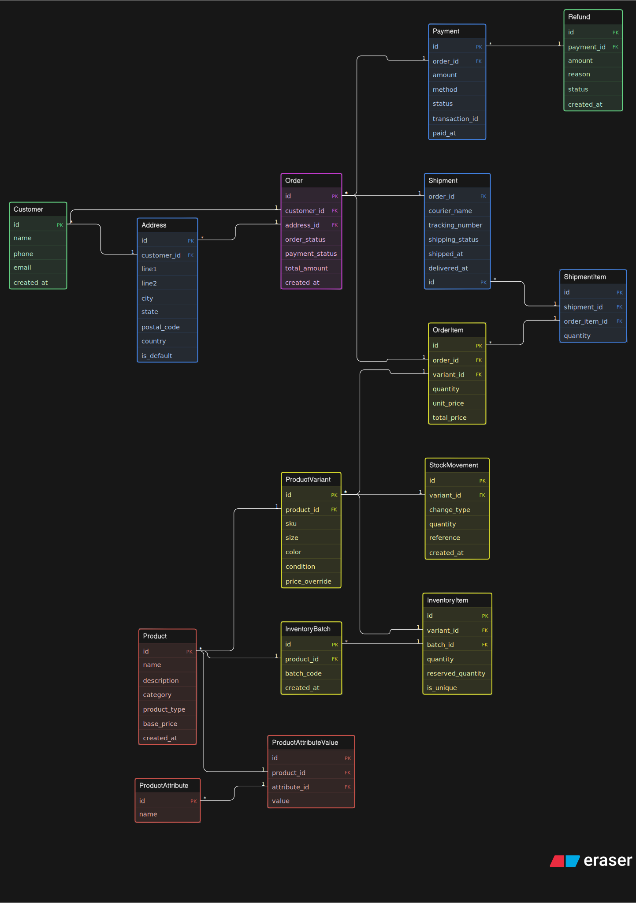

# 📦 Thrift + Handmade Store Database Design (ER Model)

## Overview

This project presents a **production-level Entity Relationship (ER) design** for a small but growing Instagram-based business that sells:

* Thrifted fashion items (unique, single-piece products)
* Handmade products (multi-unit, batch-produced items)

Initially, the business operates through Instagram DMs and WhatsApp, but as it scales, there is a need for a **structured database system** to manage:

* Products and inventory
* Customer information
* Orders and order items
* Payments and refunds
* Shipping and delivery tracking

This ER design models the system in a **realistic, scalable, and normalized way**, suitable for actual implementation.

---

# 1. Business Understanding

The design reflects two key business realities:

### 🔹 Thrift Products

* Unique items (only one piece available)
* Require condition tracking (e.g., used, like new)
* No batch production

### 🔹 Handmade Products

* Can have multiple units
* Produced in batches
* Inventory needs to be tracked per batch

### 🔹 Order Flow

* Customers place orders containing multiple products
* Orders include payment and shipping tracking
* Products are sold via variants (size, color, etc.)

This system ensures:

* No overselling of unique items
* Proper tracking of stock for handmade items
* Complete lifecycle of an order (from placement to delivery)

---

# 2. Entity Identification

The following core entities are included:

###  Customer Module

* `Customer`
* `Address`

###  Product Module

* `Product`
* `ProductVariant`
* `ProductAttribute`
* `ProductAttributeValue`

###  Inventory Module

* `InventoryItem`
* `InventoryBatch`
* `StockMovement`

###  Order Module

* `Order`
* `OrderItem`

###  Payment Module

* `Payment`
* `Refund`

###  Shipping Module

* `Shipment`
* `ShipmentItem`

All essential components (products, orders, customers, inventory, payments, shipping) are covered.

---

# 3. Relationships and Cardinality

### One-to-Many Relationships

* One customer → many orders
* One product → many variants
* One order → many order items
* One order → one payment
* One order → one shipment

### Many-to-Many Relationship

* Orders ↔ Products handled via `OrderItem` (junction table)

### Key Relationship Examples

* `Customer.id → Order.customer_id`
* `Order.id → OrderItem.order_id`
* `ProductVariant.id → OrderItem.variant_id`

### Advanced Relationships

* `ShipmentItem` allows **partial delivery**
* `StockMovement` tracks inventory changes (audit trail)

---

# 4. Attributes Quality

### Product Attributes

* `size`, `color`, `condition`
* Dynamic attributes via `ProductAttributeValue`
* Supports flexible product expansion

### Order Attributes

* `order_status`, `payment_status`
* `total_amount`, timestamps

### Inventory Attributes

* `quantity`, `reserved_quantity`
* `is_unique` distinguishes thrift vs handmade

### Payment Attributes

* `method`, `status`, `transaction_id`

All attributes are:

* Realistic
* Properly separated
* Non-redundant

---

# 5. Primary Keys and Foreign Keys

### Primary Keys

Each entity has a unique identifier:

* `Customer.id`
* `Product.id`
* `Order.id`
* etc.

### Foreign Keys

Used to establish relationships:

* `Order.customer_id`
* `OrderItem.variant_id`
* `Payment.order_id`
* `Shipment.order_id`

### Design Strength

* Ensures referential integrity
* Supports relational queries efficiently

---

# 6. Clarity and Diagram Structure

The ER diagram is organized into clear modules:

* Left: Customer
* Center: Order (core system)
* Right: Product
* Bottom: Inventory
* Bottom-right: Payment & Shipping

### Design Principles

* No overlapping relationships
* Logical grouping of entities
* Clear separation of concerns

This makes the diagram:

* Easy to read
* Easy to explain
* Suitable for evaluation

---

# 7. Overall Thoughtfulness

This design goes beyond a basic shop model:

### ✅ Real-world considerations included:

* Thrift vs handmade differentiation
* Inventory reservation to prevent overselling
* Batch-based inventory for handmade items
* Payment failures and refunds
* Partial shipments

### ✅ Scalability

* Supports future expansion (e.g., website, more product attributes)

### ✅ Normalization

* Avoids redundancy
* Uses junction tables properly
* Keeps data modular

---

# 🏁 Conclusion

This ER model provides a **complete, scalable, and realistic database design** for a growing thrift + handmade business.

It successfully:

* Captures business complexity
* Maintains clean structure
* Supports real-world operations

The system is ready to be implemented in a relational database like MySQL, PostgreSQL, or any modern backend system.

---
### Made By: Suprabhat

