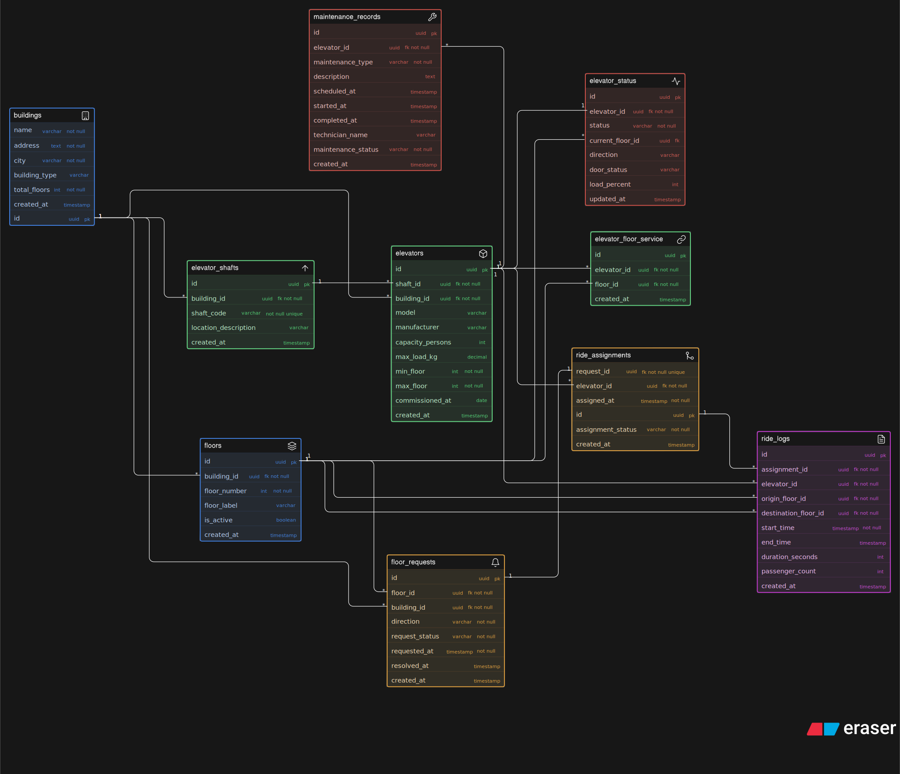

# 🏗️ Smart Elevator Control System — Database Design

> An ER diagram for LiftGrid Systems' intelligent elevator control platform — a multi-building infrastructure management system handling real-time movement requests, elevator allocation, and operational tracking across large commercial buildings.

---

## 📌 Project Overview

**LiftGrid Systems** builds intelligent elevator control platforms for large commercial buildings across India — corporate towers, malls, airports, hospitals, and high-rise residential complexes. Unlike standalone lifts, these buildings run multiple elevators per building grouped into shafts, handling thousands of passengers daily.

This project delivers the **relational database design (ER Diagram)** for the full backend platform — supporting elevator assignments, floor requests, maintenance tracking, ride logs, and real-time status monitoring.

---

## 📐 ER Diagram

> Designed using **Excalidraw**. Color-coded entity groups for quick visual orientation.

---

## 🗂️ Entities & Attributes

### 🏢 Building
The top-level entity. Each building is an independent LiftGrid installation.

| Attribute | Type | Constraint |
|---|---|---|
| `id` | uuid | PK |
| `name` | varchar | not null |
| `address` | text | not null |
| `city` | varchar | not null |
| `building_type` | varchar | e.g. `'hospital'`, `'mall'`, `'office'` |
| `total_floors` | int | not null |
| `created_at` | timestamp | |

---

### 🏬 Floor
Each floor belongs to one building. Floors are individually tracked to support per-floor request routing.

| Attribute | Type | Constraint |
|---|---|---|
| `id` | uuid | PK |
| `building_id` | uuid | FK → Building, not null |
| `floor_number` | int | not null |
| `floor_label` | varchar | e.g. `'G'`, `'B1'`, `'M'`, `'3'` |
| `is_active` | boolean | |
| `created_at` | timestamp | |

---

### 🔩 Elevator Shaft
Each shaft is a physical vertical channel in the building. One shaft houses exactly one elevator at a time.

| Attribute | Type | Constraint |
|---|---|---|
| `id` | uuid | PK |
| `building_id` | uuid | FK → Building, not null |
| `shaft_code` | varchar | not null, unique |
| `location_description` | varchar | e.g. `'North Wing, Zone A'` |
| `created_at` | timestamp | |

---

### 🛗 Elevator
The core physical unit. Each elevator is housed in one shaft and belongs to one building. Its configuration (floor range, capacity) is stored here — **not** its dynamic ride or status data.

| Attribute | Type | Constraint |
|---|---|---|
| `id` | uuid | PK |
| `shaft_id` | uuid | FK → Elevator Shaft, not null |
| `building_id` | uuid | FK → Building, not null |
| `model` | varchar | |
| `manufacturer` | varchar | |
| `capacity_persons` | int | |
| `max_load_kg` | decimal | |
| `min_floor` | int | not null |
| `max_floor` | int | not null |
| `commissioned_at` | date | |
| `created_at` | timestamp | |

---

### 🔗 Elevator–Floor Mapping *(Junction Table)*
Models the many-to-many relationship: one elevator can serve multiple floors, and one floor can be served by multiple elevators.

| Attribute | Type | Constraint |
|---|---|---|
| `id` | uuid | PK |
| `elevator_id` | uuid | FK → Elevator, not null |
| `floor_id` | uuid | FK → Floor, not null |
| `created_at` | timestamp | |

---

### 📡 Elevator Status
Tracks the **real-time dynamic state** of each elevator — deliberately separated from the Elevator configuration table to avoid mixing static and dynamic data.

| Attribute | Type | Constraint |
|---|---|---|
| `id` | uuid | PK |
| `elevator_id` | uuid | FK → Elevator, not null |
| `current_floor` | int | |
| `status` | varchar | `'idle'`, `'moving_up'`, `'moving_down'`, `'maintenance'`, `'out_of_service'` |
| `direction` | varchar | `'up'`, `'down'`, `'none'` |
| `door_status` | varchar | `'open'`, `'closed'` |
| `recorded_at` | timestamp | not null |

---

### 📥 Floor Request
Captures every user-generated request from a floor. Requests are **not stored inside the elevator** — they are independent events waiting for assignment.

| Attribute | Type | Constraint |
|---|---|---|
| `id` | uuid | PK |
| `building_id` | uuid | FK → Building, not null |
| `floor_id` | uuid | FK → Floor, not null |
| `direction_requested` | varchar | `'up'` \| `'down'` |
| `status` | varchar | `'pending'`, `'assigned'`, `'completed'`, `'cancelled'` |
| `requested_at` | timestamp | not null |
| `completed_at` | timestamp | |

---

### 🎯 Ride Assignment
Links a floor request to a specific elevator. One request results in exactly one ride assignment. This join table is the bridge between demand and supply.

| Attribute | Type | Constraint |
|---|---|---|
| `id` | uuid | PK |
| `request_id` | uuid | FK → Floor Request, not null |
| `elevator_id` | uuid | FK → Elevator, not null |
| `assigned_at` | timestamp | not null |
| `assignment_status` | varchar | `'assigned'`, `'picked_up'`, `'completed'` |

---

### 📋 Ride Log
Records the full journey details of every completed trip. Stored separately from elevator configuration so **historical ride data never overwrites elevator state**.

| Attribute | Type | Constraint |
|---|---|---|
| `id` | uuid | PK |
| `elevator_id` | uuid | FK → Elevator, not null |
| `assignment_id` | uuid | FK → Ride Assignment, not null |
| `origin_floor` | int | |
| `destination_floor` | int | |
| `passenger_count` | int | |
| `trip_start_at` | timestamp | |
| `trip_end_at` | timestamp | |
| `duration_seconds` | int | |
| `created_at` | timestamp | |

---

### 🔧 Maintenance Log
Tracks all maintenance events per elevator. History is fully preserved — maintenance records are **never overwritten** and do not pollute the elevator or status tables.

| Attribute | Type | Constraint |
|---|---|---|
| `id` | uuid | PK |
| `elevator_id` | uuid | FK → Elevator, not null |
| `maintenance_type` | varchar | `'scheduled'`, `'emergency'`, `'inspection'` |
| `description` | text | |
| `technician_name` | varchar | |
| `started_at` | timestamp | not null |
| `completed_at` | timestamp | |
| `status` | varchar | `'in_progress'`, `'completed'`, `'deferred'` |
| `created_at` | timestamp | |

---

## 🔗 Relationships & Cardinality

| Relationship | Cardinality | Description |
|---|---|---|
| Building → Floor | 1 : N | One building has many floors |
| Building → Elevator Shaft | 1 : N | One building has many elevator shafts |
| Elevator Shaft → Elevator | 1 : 1 | One shaft houses exactly one elevator |
| Building → Elevator | 1 : N | One building has many elevators (denormalized FK for direct query access) |
| Elevator ↔ Floor | M : N | Via Elevator–Floor Mapping junction table |
| Floor → Floor Request | 1 : N | Floors generate many requests over time |
| Floor Request → Ride Assignment | 1 : 1 | One request results in exactly one assignment |
| Elevator → Ride Assignment | 1 : N | One elevator handles many assignments |
| Ride Assignment → Ride Log | 1 : 1 | Each assignment produces one ride log entry |
| Elevator → Elevator Status | 1 : N | Status events tracked over time per elevator |
| Elevator → Maintenance Log | 1 : N | Maintenance history is fully preserved per elevator |

---

## 💡 Design Decisions

- **Elevator Shaft as a separate entity** — Distinguishes the physical infrastructure (shaft) from the operational unit (elevator), enabling shaft-level analytics and future multi-elevator-per-shaft scenarios.
- **Building FK on Elevator** — Even though Building can be derived via Shaft → Building, a direct `building_id` FK on Elevator allows fast single-join queries like "all elevators in building X" without traversing two tables.
- **Elevator–Floor Mapping as junction table** — Explicitly models the M:N relationship. An elevator's serviced floor range (min/max) is stored on the `Elevator` entity for range validation, while the junction table models which specific floors it stops at.
- **Elevator Status is a separate time-series table** — Prevents dynamic runtime state (`current_floor`, `status`) from polluting static configuration data. Also enables full status history logging.
- **Floor Request is independent of Elevator** — Requests are first-class entities. They enter with `status='pending'` and are assigned separately. This prevents request data from being embedded inside elevator records.
- **Ride Assignment bridges Request and Elevator** — This join table is the control plane: it explicitly records which elevator was dispatched for which request.
- **Ride Log is append-only analytics** — Journey data (origin, destination, duration) lives in its own table, never modifying the elevator or status tables, enabling unlimited historical querying.
- **Maintenance Log is fully historical** — Maintenance events are pure inserts. No overwriting, no updating elevator configuration. The elevator's `status` field handles real-time `'maintenance'` state; the log handles the full audit trail.

---

## 📊 Sample Business Questions Answered

| Question | Tables Involved |
|---|---|
| How many buildings are on the platform? | `Building` |
| How many elevators exist in a building? | `Elevator` (filter by `building_id`) |
| Which floors does elevator X serve? | `Elevator–Floor Mapping` + `Floor` |
| What requests are still pending? | `Floor Request` (filter `status='pending'`) |
| Which elevator handled the most rides today? | `Ride Log` (group by `elevator_id`, filter `trip_start_at`) |
| What is the current status of elevator Y? | `Elevator Status` (latest record for `elevator_id`) |
| Can multiple elevators serve the same floor? | Yes — via `Elevator–Floor Mapping` |
| Is elevator Z under maintenance? | `Elevator Status` + `Maintenance Log` |
| Full maintenance history for elevator A? | `Maintenance Log` (filter by `elevator_id`) |

---

## 📁 Files

| File | Description |
|---|---|
| `diagram.svg` | ER Diagram (Excalidraw export) |
| `readme.md` | This document |

---

## 🧰 Tools Used

- **Excalidraw** — for diagramming
- **Markdown** — for documentation

---

**by Suprabhat**
